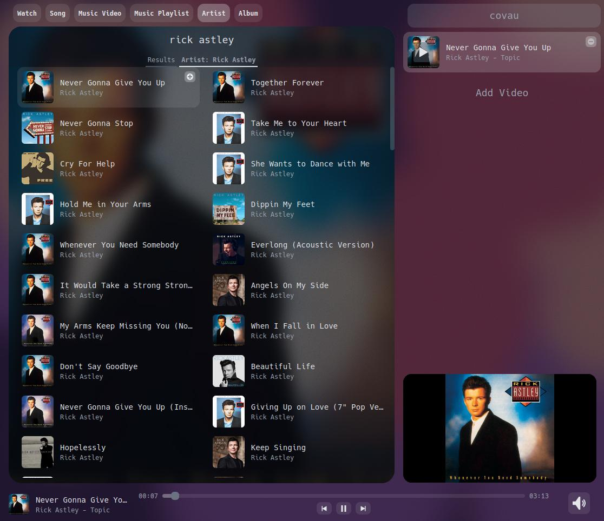

# Covau: Come Vibe Amongst Us
Welcome to Covau, your ultimate webapp for sharing music and videos with friends in real-time. Covau streamlines and synchronizes your media experience, allowing you to enjoy content together, no matter where you are. Simply share the link with your friends, and they can join in, whether it's listening to music or watching youtube videos.

[Try it out now!](https://covau.netlify.app/#/)

### Demo Video
Check out our [demo video](https://www.youtube.com/watch?v=l5NW_tI0uNs) to see Covau in action:

# Features
### Seamless Sharing
No need for accounts or complicated setups. Covau makes sharing easy and hassle-free.

### Save and Return
Save your favorite videos in a room and come back to them later. Covau remembers your queues for you.

### Effortless Queue Management
Add videos to your queue by pasting links in the "Add Video" field or use our intuitive drag-and-drop interface.
- Easily add videos to your queue by pasting their URLs or dragging links from your browser into Covau.
- Reorder videos by clicking and dragging them to change their position in the queue.
- You can also drag items from Covau and drop them directly into your browser for easy sharing and exploration.

### Cross-Platform Compatibility
Covau works flawlessly on both desktop and mobile devices, ensuring a consistent experience for everyone.

### High-Quality Playback
Covau streams videos separately on each device from YouTube, so slow internet connections won't ruin the experience for others.

### Precise Synchronization
Enjoy synchronized videos with subsecond precision, making sure everyone is on the same beat.

### Explore and Discover
Search for music, artists, playlists, and albums directly within Covau to easily find the content you love.

### Enhanced Viewing
Watch your favorite videos in a larger window for an immersive experience.

# Screenshots
### Search for Your Favorites


### Enjoy Videos on a Bigger Screen


### Mobile-Friendly Experience


# License
Covau is open-source software distributed under the MIT License. Feel free to use, modify, and share it with others, following the terms outlined in the license.

# Contributing
We invite you to contribute and help enhance Covau. To ensure a coordinated effort, please consider opening an issue to discuss your proposed feature or changes before diving into a pull request. Whether you're reporting bugs, suggesting improvements, or submitting code modifications, your contributions are highly appreciated and valuable to our project.

### Here's how you can get started:
- Fork the Covau repository.
- Create a new branch for your contribution: git checkout -b feature/your-feature-name.
- Make your changes, commit them, and push to your fork.
- Create a pull request (PR) to the main branch of the Covau repository.

Let's build a better Covau together!

# Development
Ready to dive into Covau's development? Follow these simple steps to get started:
1. Set up Netlify CLI
Make sure you have the [Netlify CLI](https://docs.netlify.com/cli/get-started/) installed on your system. This tool will help you deploy and manage your Covau web application.


2. Install Dependencies
Run the following command to install the necessary project dependencies:
```bash
npm install
````

3. Run Locally
Start the development server by running:
```bash
npm run netlify-dev
````

4. Test Locally
Open your web browser and navigate to:
```bash
http://localhost:8888
````

Now, you can start working on Covau's codebase and see your changes in action locally.

Happy coding! If you have any questions or need assistance, feel free to reach out.
